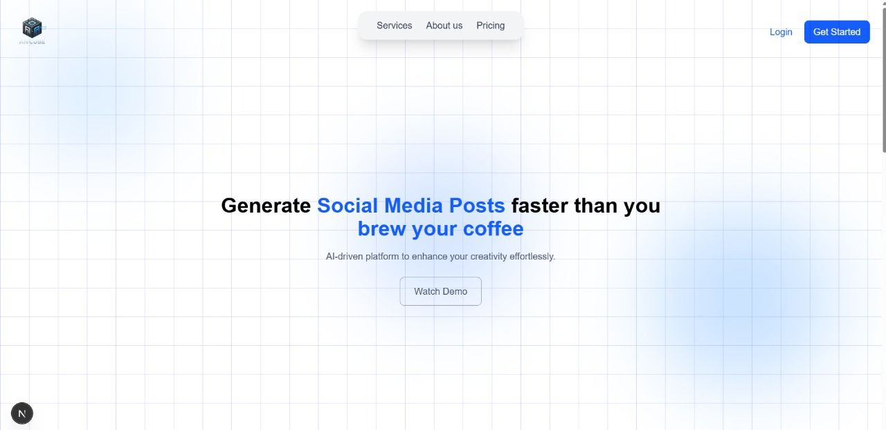
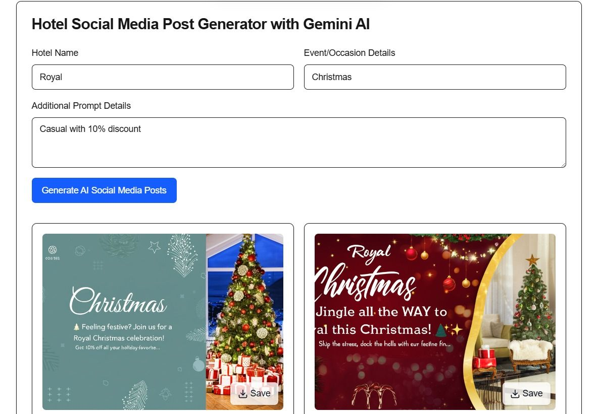

# PostJini — AI Social Media Post Generator for Hotels ⚡️

PostJini (repo: ANcube-) is an AI-driven marketing tool that helps small and mid-sized hotels create branded social media posts, captions, and visuals in seconds. It combines Google’s Gemini generative models with a simple Next.js + Tailwind UI to produce concise, on-brand posts and accompanying images that can be edited, regenerated, and downloaded.

---

## Table of contents 📚

- [Features](#features)
- [Tech stack](#tech-stack)
- [Architecture](#architecture)
- [Quick start](#quick-start)
- [Environment variables](#environment-variables)
- [Usage](#usage)
- [Development notes & experiments](#development-notes--experiments)
- [Deployment](#deployment)
- [Troubleshooting](#troubleshooting)
- [Contributing](#contributing)
- [Security & privacy](#security--privacy)
- [Acknowledgements](#acknowledgements)

---

## Features ✅

- Generate multiple short social posts (text) tailored to an event, hotel, and tone.
- Generate accompanying images (via Gemini image generation) and embed them as data URLs.
- Regenerate individual posts or images, edit text in-place, copy text to clipboard, and download images.
- Robust server API that parses AI responses, handles common parsing failures, and falls back to heuristics.
- Simple, accessible UI built with shadcn UI components and Tailwind CSS.

## Tech stack 🔧

- Frontend: Next.js 15, React 19, Tailwind CSS
- AI: Google Gemini via the `@google/generative-ai` client
- Styling/UI: Tailwind, shadcn components, Framer Motion
- Data & auth: Firebase (Firestore + Auth) included (example config present in `src/lib/firebase.js`)
- Dev tooling: ESLint, PostCSS

## Architecture 🏗️

- The client UI lives under `src/app` and `src/components` (see `Inputfield` component for the main flow).
- Server-side API routes in `src/app/api` handle interaction with Gemini:
  - `/api/generate-posts` — generates text posts
  - `/api/gemini` — generates images (text + image modalities)
  - `/api/regenerate-post` — regenerates a single post
- `src/utils/gemini.js` centralizes Gemini model initialization and helper functions.
- `model_1.py` is an experimental Colab script for offline captioning and image generation (T5 + Stable Diffusion). It is not required for the web app but useful for research/experiments.

## Quick start 🚀

1. Prerequisites:
   - Node.js (18+ recommended)
   - npm, pnpm, or yarn
   - A Google Generative AI (Gemini) API key

2. Install dependencies:

```bash
npm install
# or
# pnpm install
# yarn
```

3. Add your API key to a local environment file (create `.env.local` in project root):

```text
GOOGLE_AI_API_KEY=your_google_generative_ai_key_here
```

> Note: `next.config.mjs` exposes this key as `NEXT_PUBLIC_GOOGLE_AI_API_KEY` for the frontend if needed.

4. Run the development server:

```bash
npm run dev
# visit http://localhost:3000
```

5. Build for production:

```bash
npm run build
npm run start
```

## Environment variables 🔐

- `GOOGLE_AI_API_KEY` — Required. The API key used with `@google/generative-ai` (Gemini).
- Optional: move Firebase configuration into environment variables if you want to avoid committing them into source control.

Recommended pattern (example in `.env.local`):

```text
GOOGLE_AI_API_KEY=...
NEXT_PUBLIC_GOOGLE_AI_API_KEY=${GOOGLE_AI_API_KEY}
# FIREBASE_API_KEY=...
# FIREBASE_AUTH_DOMAIN=...
# FIREBASE_PROJECT_ID=...
```

## Usage 🧭

- Open the app and fill in:
  - Hotel name
  - Event / occasion details
  - Additional prompt details (tone, target audience, style)
- Click "Generate AI Social Media Posts" to create text posts and start image generation.
- You can:
  - Edit post text in-place
  - Regenerate text or image
  - Copy post text to clipboard
  - Download generated images

Key files to review for behavior:
- `src/components/inputfield.js` — main UI, generation flow, image handling, and download
- `src/app/api/generate-posts/route.js` — text generation server-side logic and parsing
- `src/app/api/gemini/route.js` — image generation server-side logic
- `src/utils/gemini.js` — Gemini model initialization and helper functions

## Development notes & experiments 🧪

- `model_1.py` is a Colab-exported script that uses T5 and Stable Diffusion for offline captioning and image experiments. It contains code for fine-tuning a T5 model and using Stable Diffusion pipelines; run it in a GPU-enabled Colab environment only.
- Firebase is initialized in `src/lib/firebase.js` with a project config. Consider replacing hard-coded config with env-based config before production use.

## Deployment ✅

- Deploy like a standard Next.js app (Vercel, Cloud Run, or similar).
- Make sure to set `GOOGLE_AI_API_KEY` (and any Firebase env vars) in your deployment provider environment settings.
- Run `npm run build` and ensure the server can access the API key.

## Troubleshooting & Common Errors ⚠️

- "API key is not configured" — make sure `GOOGLE_AI_API_KEY` is set locally and in production.
- Quota / authentication errors — check your Google Cloud account usage/quota and API permissions.
- Parsing AI output — the server attempts multiple fallbacks (JSON direct parse, regex extraction, line-by-line) but in edge cases you may need to tweak prompts or parsing heuristics in `generate-posts`.

## Contributing 🤝

- Open issues for bugs or feature requests.
- For PRs: fork the repository, create a feature branch, and open a pull request with a clear description and small, focused commits.
- Add tests for any new parsing logic or important utility functions.

## Security & Privacy 🔒

- Do not commit secret keys to source control.
- Move sensitive configuration (API keys, service credentials) to environment variables and a secrets manager for production.
- The current repo contains a Firebase config in `src/lib/firebase.js` — replace this with env-based config in production.

## Acknowledgements 🙏

- Built with Google Gemini generative models (`@google/generative-ai`) and Next.js.
- UI components inspired by shadcn/ui and Tailwind CSS.

---

## images 📸

-  — hero / dashboard screenshot placeholder
-  — feature tile placeholder
-  — Generated Posts
-  — structure of a post


